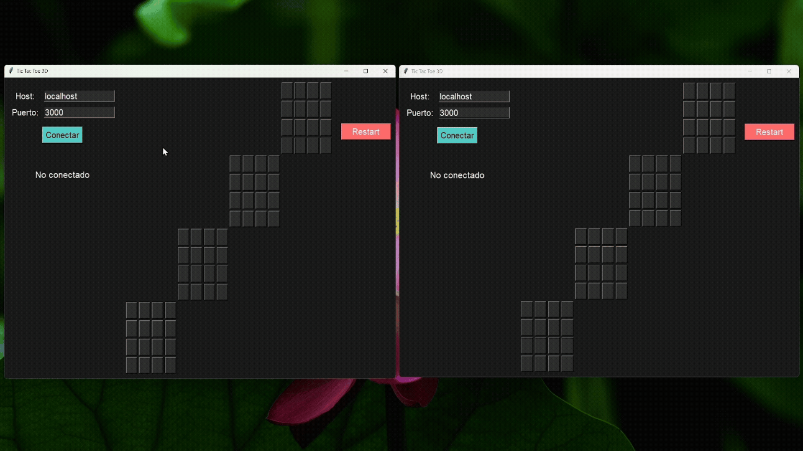

<h1 align="center">TicTacToe3D</h1>

<p align="center">
  <strong>Classic tic-tac-toe, but in a 4×4×4 cube — play against a friend over the network.</strong>
</p>

<p align="center">
  
  
  
</p>

<p align="center">
TicTacToe3D is an online 2 player tic-tac-toe played on a 4x4x4 board, built with Tkinter and plain TCP sockets to emphasize plain networking.
</p>



<p align="center">
  <em>Two clients connected to the same server, taking turns and hunting for 4-in-a-row across three dimensions.</em>
</p>

## Built With

| Layer        | Technology                                                |
| ------------ | --------------------------------------------------------- |
| UI Framework | [Tkinter](https://docs.python.org/3/library/tkinter.html) |
| Language     | Python 3                                                  |
| Networking   | TCP sockets, one thread per client                        |
| Protocol     | JSON messages                                             |

## Features

- **Winning line highlight:** when someone lines up 4, the winning cells light up yellow on red.
- **Restart on demand:** once there's a winner, either player can request a rematch, the server resets the board and Player 1 starts again. No restarting mid-game while you're losing, tramposo.
- **Disconnect handling:** if your opponent leaves, you're notified and the server resets itself for the next pair.

## Running the Project

Requirements:

- Python 3
- Two players (or two terminals and some multitasking)

1. Start the server, passing the port as an argument:

   ```
   python servidor.py 3000
   ```

2. Start a client (twice, once per player):

   ```
   python tictactoe3D.py
   ```

3. Enter the server's host and port (defaults to `localhost:3000`) on each of the client's UIs and hit **Conectar**.
4. Once both players connect, the game starts automatically.

A third client trying to join gets politely rejected: the server only seats 2 players.

## Project Layout

<details>
<summary><strong>Expand the project tree</strong></summary>

<br>

```
tictactoe3d/
├── servidor.py       #Server
├── tictactoe3D.py    #Tkinter client.
```

</details>

---

<p align="center">
  <sub><strong>Raúl Villarreal</strong> · 2026</sub>
</p>
